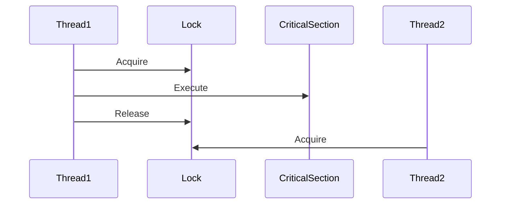

# 02 – Threading, Race Conditions & Synchronization

## Creating Threads in C#

### Using `Thread` class

```csharp
Thread worker = new Thread(DoWork);
worker.Start();

void DoWork()
{
    Console.WriteLine("Worker thread running");
    Thread.Sleep(1000);
}
```

### Key Points
- Low-level API
- OS-managed thread
- Rarely used in modern C# directly

---

## Race Condition

### What is a Race Condition?
Occurs when **multiple threads access shared data simultaneously** without synchronization.

```csharp
counter++; // NOT thread-safe
```

### Why it happens?
`counter++` = Read → Modify → Write (3 steps)

---

## Synchronization using `lock`

### Mutual Exclusion
Only **one thread** can enter the critical section.

```csharp
lock (_lockObject)
{
    counter++;
}
```

### Best Practices
- Lock only the critical section
- Use private lock objects

---

## Monitor

### What?
Low-level synchronization primitive behind `lock`.

```csharp
Monitor.Enter(_lockObject);
try
{
    counter++;
}
finally
{
    Monitor.Exit(_lockObject);
}
```

---

## Mutex vs Semaphore

### Full Forms
- Mutex → Mutual Exclusion
- Semaphore → Signaling Mechanism

| Feature | Mutex | Semaphore |
|------|------|------|
Access | One | N |
Ownership | Yes | No |
Use Case | Single resource | Resource pool |

---

## Mermaid Diagram – Locking



---

## Hands-on Exercises
1. Create a shared counter
2. Increment using multiple threads
3. Observe incorrect result
4. Fix using `lock`

---

## Key Takeaways
- Race conditions corrupt data
- Locks protect shared state
- Prefer high-level abstractions where possible
