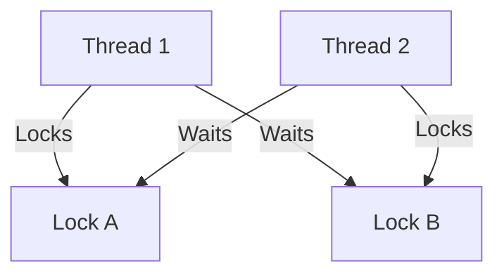

# 03 – Deadlocks & Debugging

## What is a Deadlock?
A **deadlock** occurs when threads wait indefinitely for resources held by each other.

---

## Deadlock Conditions
1. Mutual Exclusion
2. Hold and Wait
3. No Preemption
4. Circular Wait

---

## Real Deadlock Example

```csharp
lock(A)
{
    Thread.Sleep(100);
    lock(B)
    {
    }
}
```

---

## Deadlock Diagram (Mermaid)



---

## Debugging Deadlock in Visual Studio
1. Debug → Break All
2. Open Threads window
3. Inspect Call Stack
4. Identify circular waits

---

## Fix Strategies
- Consistent lock ordering
- Reduce lock scope
- Prefer message passing

---

## Hands-on Exercise
Create two locks and intentionally cause a deadlock, then fix it.

