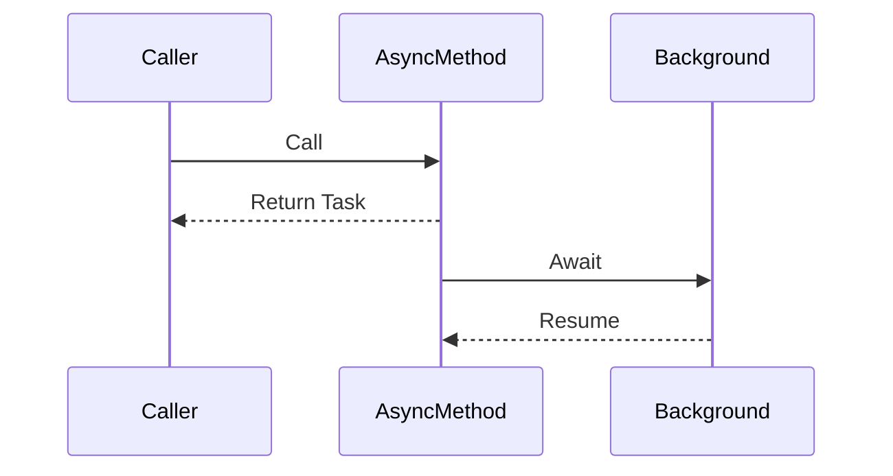

# 04 – Tasks, Async & Await (Modern Concurrency)

## Why Tasks?

### Problem with Threads
- Expensive OS resources
- Hard to compose
- Manual lifetime management

### Solution: Task Parallel Library (TPL)
- Higher-level abstraction
- Work-stealing thread pool
- Better scalability

---

## Task vs Thread

| Aspect | Thread | Task |
|------|--------|------|
Level | Low | High |
Managed by | OS | .NET Runtime |
Scalability | Poor | Excellent |
Composition | Hard | Easy |

---

## Creating Tasks

```csharp
Task task = Task.Run(() =>
{
    Console.WriteLine("Running on background thread");
});

await task;
```

---

## Async & Await

### What?
`async` allows non-blocking asynchronous execution.

### How?
- Caller is freed
- Continuation resumes later

```csharp
async Task<int> FetchDataAsync()
{
    await Task.Delay(1000);
    return 42;
}
```

---

## Mermaid Diagram – Async Flow



---

## Common Async Deadlock

```csharp
// BAD
var result = FetchDataAsync().Result;
```

### Why Deadlock Happens?
- SynchronizationContext captures thread
- Continuation waits for blocked thread

---

## ConfigureAwait(false)

### What?
Avoid capturing context

```csharp
await Task.Delay(1000).ConfigureAwait(false);
```

### When to Use?
- Library code
- Non-UI logic

---

## Best Practices
- Async all the way
- Avoid .Wait() and .Result
- Prefer Task over Thread

---

## Hands-on Exercises
1. Convert sync method to async
2. Call it using await
3. Introduce `.Result` deadlock
4. Fix using await

---

## Interview Quick Answers
- **Task**: Logical unit of work
- **Async**: Non-blocking execution
- **Deadlock**: Blocking + captured context

---

## Key Takeaways
- Tasks scale better than threads
- Async prevents blocking
- Wrong usage causes deadlocks
