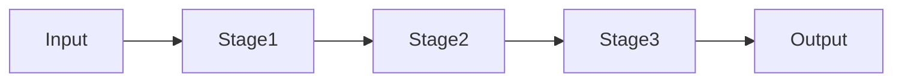

# 07 – Advanced Concurrency Patterns (Pipeline & Actor)

## Why Advanced Patterns?

As systems grow:
- Locks don’t scale
- Shared state becomes risky
- Reasoning becomes hard

Advanced patterns solve this structurally.

---

## Pipeline Pattern

### What?
Data flows through **stages**, each stage does one job.

### When to Use?
- ETL (Extract, Transform, Load)
- Streaming data
- Batch processing

---

## Pipeline – Conceptual Diagram



---

## Pipeline Example (TPL Dataflow)

```csharp
var fetch = new TransformBlock<int, int>(x => x * 2);
var process = new TransformBlock<int, int>(x => x + 10);
var write = new ActionBlock<int>(x => Console.WriteLine(x));

fetch.LinkTo(process);
process.LinkTo(write);

fetch.Post(5);
fetch.Complete();
```

---

## Actor Pattern

### What?
Each actor:
- Owns its state
- Processes one message at a time
- Never shares memory

---

## Actor – Conceptual Diagram


---

## Actor Example (Simplified)

```csharp
class Actor
{
    private readonly Channel<string> _mailbox = Channel.CreateUnbounded<string>();

    public Actor()
    {
        Task.Run(async () =>
        {
            await foreach (var msg in _mailbox.Reader.ReadAllAsync())
            {
                Console.WriteLine($"Handled: {msg}");
            }
        });
    }

    public void Send(string message)
    {
        _mailbox.Writer.TryWrite(message);
    }
}
```

---

## Pipeline vs Actor

| Aspect | Pipeline | Actor |
|------|--------|------|
Flow | Linear | Message-based |
State | Shared flow | Actor-owned |
Scaling | Stage-based | Actor-based |

---

## Real-world Usage
- Pipelines → Data processing systems
- Actors → Trading systems, chat apps

---

## Hands-on Exercises
1. Build 3-stage pipeline
2. Add delays per stage
3. Observe parallelism

---

## Interview Quick Answers
- **Pipeline**: Stage-based concurrency
- **Actor**: Message-driven isolation

---

## Key Takeaways
- Avoid shared state
- Model concurrency explicitly
- Architecture > Locks
