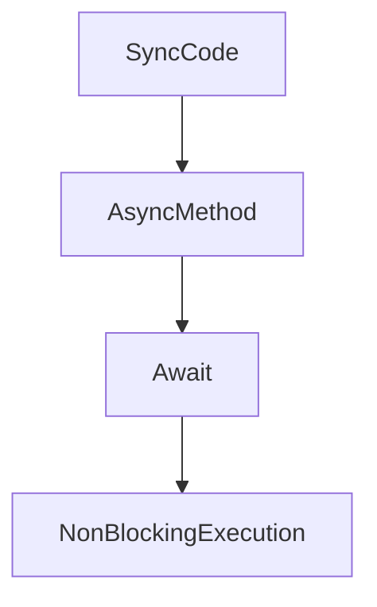

# 08 – Refactoring Legacy Synchronous Code to Async (Safely)

## Why Refactor Sync Code?

Legacy synchronous code:
- Blocks threads
- Scales poorly
- Causes thread starvation under load

Async refactoring improves **throughput, responsiveness, and scalability**.

---

## Typical Legacy Synchronous Code

```csharp
public string GetData()
{
    Thread.Sleep(1000); // blocking
    return "data";
}
```

### Problems
- Blocks thread pool thread
- Wastes resources
- Limits scalability

---

## Step 1 – Introduce Async API

```csharp
public async Task<string> GetDataAsync()
{
    await Task.Delay(1000);
    return "data";
}
```

✔ Non-blocking  
✔ Scales better

---

## Step 2 – Async All the Way

❌ **Bad**
```csharp
var data = GetDataAsync().Result;
```

✅ **Good**
```csharp
var data = await GetDataAsync();
```

---

## Step 3 – Propagate Async Upwards

```csharp
public async Task ProcessAsync()
{
    var data = await GetDataAsync();
    Console.WriteLine(data);
}
```

Rule: **Once async, always async**.

---

## Common Pitfalls

### 1. Mixing Sync + Async
- `.Wait()`
- `.Result`

→ Causes deadlocks

### 2. Forgetting Cancellation

```csharp
async Task WorkAsync(CancellationToken token)
{
    await Task.Delay(1000, token);
}
```

---

## ConfigureAwait(false)

### Why?
Avoid resuming on captured context

```csharp
await Task.Delay(1000).ConfigureAwait(false);
```

### When?
- Library code
- Backend services

---

## Mermaid Diagram – Async Refactoring Flow



---

## Production Checklist

✔ No `.Wait()` / `.Result`  
✔ Cancellation tokens supported  
✔ Async all the way  
✔ ConfigureAwait(false) in libraries

---

## Hands-on Exercise
1. Take a blocking method
2. Convert it to async
3. Propagate async upward
4. Remove all blocking calls

---

## Interview Quick Answers

- **Why async refactor?** Scalability
- **Biggest mistake?** Blocking async code
- **Golden rule?** Async all the way

---

## Final Takeaways

- Async refactoring is incremental
- Blocking kills scalability
- Correct async code is simpler than locks

---

🎉 **Congratulations! You now have a complete, structured, production-ready C# concurrency knowledge base.**
